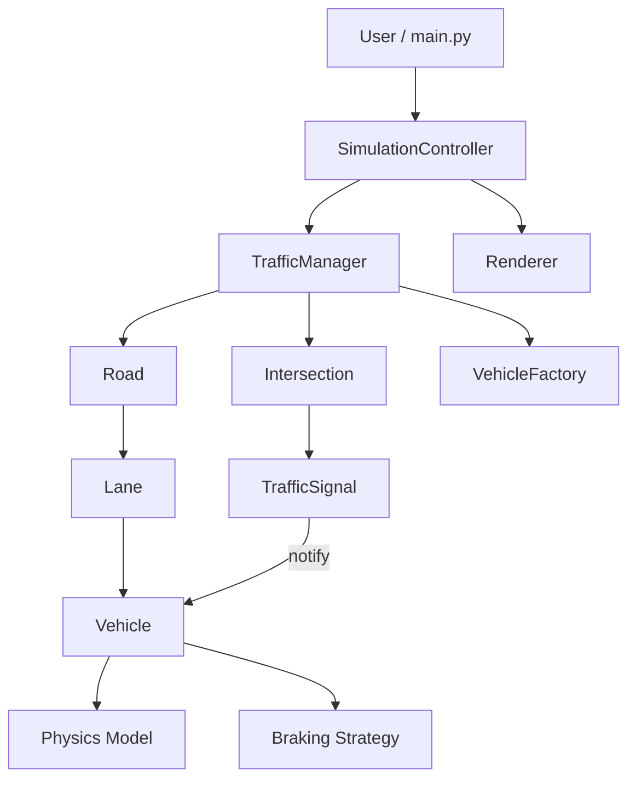

# FlowSync

FlowSync is a Python traffic simulation project focused on a clean, extensible architecture for vehicle behavior, traffic control, and visualization.

## Project Status

The current implementation has a working simulation loop and a clear update order.

Implemented so far:

- `SimulationController` runs the outer loop.
- `TrafficManager` orchestrates intersections, roads, and entity setup.
- `TrafficSignal` notifies vehicles through the observer flow.
- `Vehicle` uses physics and braking strategies for motion decisions.
- `Lane` maintains deterministic lead-vehicle ordering.

Current focus:

- refining road-network behavior and edge cases
- expanding vehicle dynamics and signal-aware responses
- keeping the documentation aligned with the implementation

## Goals

- Build a modular traffic simulation foundation using clear separation of concerns
- Keep domain components extensible for future models and traffic policies
- Support experimentation for traffic engineering and autonomous systems scenarios

## High-Level Architecture



The simulation updates in this order:

1. intersections and signals update first
2. roads and lanes update second
3. vehicles react to the latest signal state and lead vehicle information

For a fuller explanation of the design choices, see [docs/Architecture_Report.md](docs/Architecture_Report.md).

## Repository Structure

```text
FlowSync/
├── src/
│   ├── assets/
│   ├── core/
│   ├── entities/
│   ├── factory/
│   ├── physics/
│   ├── rendering/
│   ├── simulation/
│   ├── utils/
│   ├── main.py
│   ├── requirements.txt
│   └── settings.py
├── diagrams
├── docs
├── LICENSE
└── README.md
```

## Requirements

- Python 3.10+
- Dependencies listed in `requirements.txt`

## Setup

```bash
git clone https://github.com/krishiv274/FlowSync.git
cd FlowSync
python -m pip install -r src/requirements.txt
```

## Run

```bash
python src/main.py
```

## Roadmap

- Continue refining the road network update flow and vehicle behavior
- Expand physics and braking strategies for more realistic driving models
- Add richer rendering and simulation controls
- Grow test coverage for stress and integration scenarios

## Contributing

Contributions are welcome. If you want to help:

1. Open an issue describing the bug or feature proposal.
2. Fork the repository and create a focused branch.
3. Submit a pull request with clear change notes.

## License

This project is licensed under the MIT License.
