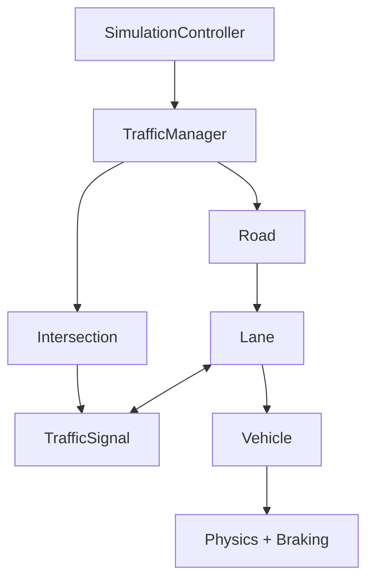

# FlowSync

FlowSync is a Python-based traffic simulation project focused on building a clean, extensible architecture for vehicle behavior, traffic control, and visualization.

## Project Status

This repository now has a working simulation architecture with the core control flow in place.

Implemented so far:
- `SimulationController` and `TrafficManager` orchestrate the simulation loop
- Roads, intersections, lanes, and traffic signals are integrated into the update flow
- Vehicles use physics and braking models for motion decisions
- Tests cover the simulation flow, road network, signals, intersections, and edge cases

Current focus:
- Refining lane, road, and intersection behavior
- Expanding vehicle dynamics and signal-aware responses
- Hardening the simulation with additional edge and stress coverage

## Goals

- Build a modular traffic simulation foundation using clear separation of concerns
- Keep domain components extensible for future models (IDM, lane changing, adaptive control)
- Support experimentation for traffic engineering and autonomous systems scenarios

## High-Level Architecture



This is the current control and data flow used by the simulation, with the controller and manager coordinating updates across the road network and vehicle dynamics.

## Repository Structure

```text
FlowSync/
├── src/
│   ├── assets/
│   ├── core/
│   ├── entities/
│   ├── factory/
│   ├── physics/
│   ├── rendering/
│   ├── simulation/
│   ├── utils/
│   ├── main.py
│   ├── requirements.txt
│   └── settings.py
├── diagrams
├── docs
├── LICENSE
└── README.md
```

## Requirements

- Python 3.10+
- Dependencies listed in `requirements.txt`

## Setup

```bash
git clone https://github.com/krishiv274/FlowSync.git
cd FlowSync
python -m pip install -r src/requirements.txt
```

## Run

```bash
python src/main.py
```

## Roadmap

- Continue refining the road network update flow and vehicle behavior
- Expand physics and braking strategies for more realistic driving models
- Add richer rendering and simulation controls
- Grow test coverage for stress and integration scenarios

## Contributing

Contributions are welcome. If you want to help:

1. Open an issue describing the bug or feature proposal.
2. Fork the repository and create a focused branch.
3. Submit a pull request with clear change notes.

## License

This project is licensed under the MIT License.
