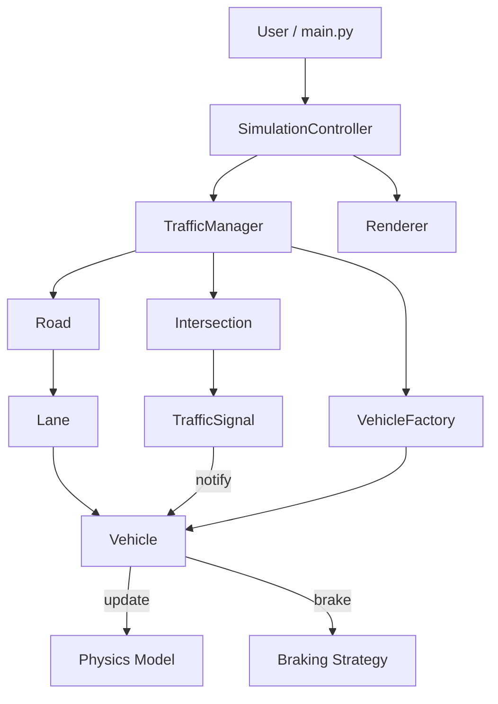
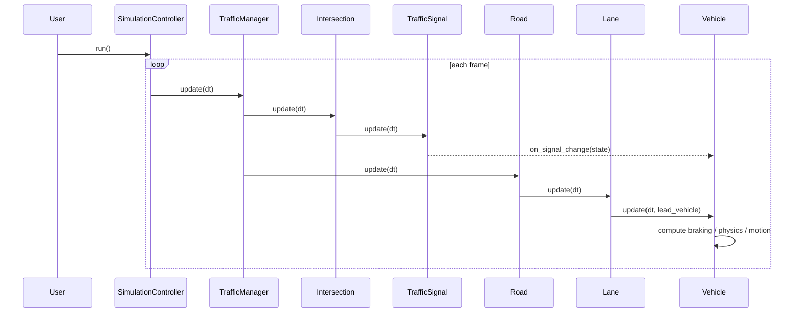
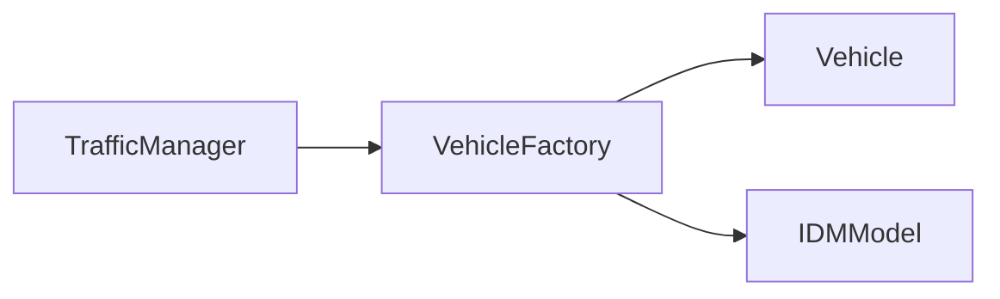
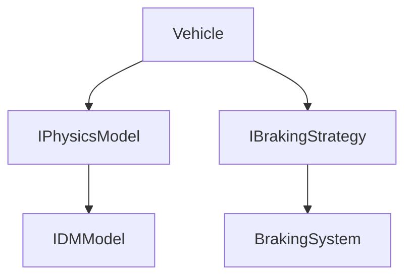
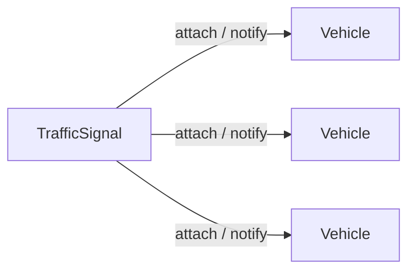
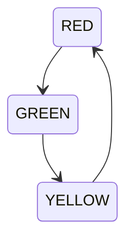

# FlowSync Architecture Report: SOLID and Design Patterns

This report explains the current structure of FlowSync with a focus on SOLID principles and the design patterns actually used in the codebase. It is based on the runtime path through `SimulationController`, `TrafficManager`, the road network entities, vehicle behavior, and the signal system.

## 1. Executive Summary

FlowSync is organized as a layered traffic simulation:

- `SimulationController` owns the outer loop.
- `TrafficManager` coordinates the simulation domain objects.
- `Road`, `Lane`, `Intersection`, `TrafficSignal`, and `Vehicle` model the traffic network.
- Vehicle motion is delegated to pluggable physics and braking strategies.
- Traffic signals notify vehicles through an observer-style callback.
- Vehicles are created through a factory instead of direct construction at call sites.

The architecture is mostly clean and modular. The strongest areas are Strategy, Observer, and Factory usage. The main remaining coupling is in `TrafficManager`, which still assembles concrete objects and therefore acts as the composition root for the simulation.

## 2. High-Level Architecture

### What this diagram means

The system is intentionally top-down. The controller does not know traffic rules. It only advances the simulation. The manager does not compute physics. It only orders updates and coordinates entities. The vehicle is the behavior hub: it applies physics, braking, and signal-aware motion.

## 3. Runtime Sequence

### Why the order matters

The update order is critical:

1. Signals advance first.
2. Vehicles then react to the latest signal state.
3. Roads and lanes preserve positional ordering before lead-vehicle lookup.

This avoids stale-state behavior where vehicles would move based on the previous tick’s signal state.

## 4. SOLID Analysis

### S: Single Responsibility Principle

Most classes have one clear job:

- `SimulationController` manages the application loop, rendering, and termination.
- `TrafficManager` orchestrates domain updates and scene setup.
- `Road` groups lanes and forwards updates.
- `Lane` maintains vehicle ordering and updates vehicles with lead context.
- `Intersection` owns signals for its lanes.
- `TrafficSignal` is a timer-driven state machine plus observer subject.
- `Vehicle` handles position, velocity, acceleration, and response to signal state.
- `Renderer` only visualizes the current state.

This is a strong SRP implementation overall. The only notable exception is `TrafficManager.initialize_scene()`, which both creates the initial world and wires dependencies. That is acceptable because it acts as the composition root, but it is still more than a single narrow responsibility.

### O: Open/Closed Principle

The codebase is extensible in several places without changing the core classes:

- New physics models can be added by implementing `IPhysicsModel`.
- New braking behaviors can be added by implementing `IBrakingStrategy`.
- `Lane` can accept a custom strategy or callable update function.
- `VehicleFactory.registry` can be extended with new vehicle types.
- `TrafficSignal` cycle behavior can be configured via `cycle_times`.

This is one of the strongest principles in the project. The vehicle update path is built around plugging in new behavior rather than hard-coding a single algorithm.

### L: Liskov Substitution Principle

Substitutability is respected where abstractions are defined:

- `IDMModel` can stand in for any `IPhysicsModel`.
- `BrakingSystem` can stand in for any `IBrakingStrategy`.
- `VehicleLike` lets lane logic operate on anything with the expected vehicle shape.

The tests also reinforce this. The interface tests verify that abstract base classes are non-instantiable and that concrete implementations satisfy the contracts.

One caution: `Vehicle` itself is not a clean polymorphic base class in the same way as the strategy interfaces. It is more of a domain entity with composition-based behavior. That is fine, but it means substitutability is mostly expressed through interfaces rather than inheritance.

### I: Interface Segregation Principle

The codebase favors narrow interfaces:

- `IPhysicsModel` exposes only `compute_acceleration()`.
- `IBrakingStrategy` exposes only `should_brake()`.
- `SignalObserver` exposes only `on_signal_change()`.
- `VehicleLike` exposes only the fields and method required by lane updates.

That is a good ISP shape. Clients depend on just the methods they need instead of large “god interfaces.”

### D: Dependency Inversion Principle

The project uses dependency inversion in the behavior layer:

- `Vehicle` depends on physics and braking abstractions rather than hard-coded algorithms.
- `Lane` depends on `UpdateStrategy` instead of directly encoding update behavior.
- `TrafficSignal` depends on the observer protocol, not concrete vehicle classes.

However, the higher-level orchestration layer still instantiates concrete classes directly:

- `TrafficManager` creates `Road`, `Lane`, `Intersection`, `TrafficSignal`, and vehicles.
- `VehicleFactory` currently returns a concrete `Vehicle` with a concrete `IDMModel`.

This is a pragmatic and common compromise. The architecture is DIP-friendly where behavior varies, while the root wiring remains concrete.

## 5. Design Patterns in Use

### 5.1 Factory Pattern

`VehicleFactory` centralizes vehicle creation.

#### Role in the codebase

- The factory hides vehicle construction details.
- Call sites ask for a vehicle type instead of manually constructing a vehicle.
- The factory assigns IDs and initial behavior in one place.

#### Benefit

This keeps object creation from leaking into simulation code and makes it easier to add new vehicle types later.

### 5.2 Strategy Pattern

Strategy is used in two places:

- Physics model selection via `IPhysicsModel`.
- Braking behavior via `IBrakingStrategy`.

#### Role in the codebase

- `Vehicle` delegates acceleration computation to the physics strategy.
- `Vehicle` asks the braking strategy whether braking should occur.
- The chosen strategy can be swapped without changing `Vehicle` internals.

#### Benefit

This is the main extensibility mechanism for traffic behavior.

### 5.3 Observer Pattern

`TrafficSignal` publishes state changes to registered observers, and `Vehicle` reacts through `on_signal_change()`.

#### Role in the codebase

- Signals avoid polling-driven coupling.
- Vehicles get immediate state updates.
- Multiple vehicles can observe the same signal.

#### Benefit

This is a good fit for traffic lights because state changes are discrete and broadcast-like.

### 5.4 State Machine Behavior

`TrafficSignal` also behaves like a simple state machine.

#### Role in the codebase

- The signal advances through a fixed cycle.
- Each state has a timer.
- State changes are deterministic and easy to test.

#### Note

This is not a full GoF State pattern implementation because the state logic is not split into separate state objects. It is better described as an explicit state machine embedded in `TrafficSignal`.

### 5.5 Front Controller / Orchestrator

`SimulationController` plays the role of a front controller for the app loop.

#### Role in the codebase

- It owns the run loop.
- It handles exit conditions and frame timing.
- It delegates all domain work to `TrafficManager`.
- It delegates visualization to `Renderer`.

#### Benefit

This keeps the entry point thin and prevents UI and domain logic from becoming mixed together.

## 6. Class-By-Class Responsibility Map

| Class | Primary responsibility | Key principle / pattern |
| --- | --- | --- |
| `SimulationController` | Top-level loop and coordination | Orchestrator / Front Controller |
| `TrafficManager` | Simulation composition and update order | Composition root |
| `Road` | Container for lanes and road-level updates | Aggregation |
| `Lane` | Vehicle ordering and per-vehicle update delegation | Strategy |
| `Intersection` | Signal ownership by lane | Association |
| `TrafficSignal` | Timed state transitions and observer notifications | Observer + state machine |
| `Vehicle` | Motion and response to environment | Strategy consumer |
| `VehicleFactory` | Vehicle creation and initialization | Factory |
| `IDMModel` | Car-following acceleration model | Strategy implementation |
| `BrakingSystem` | Brake decision and braking intensity | Strategy implementation |
| `Renderer` | Visualization and console fallback | Presentation layer |

## 7. What Is Good Today

- The simulation loop is clearly layered and easy to follow.
- Behavior is separated from entity structure in the vehicle subsystem.
- Signal updates are event-driven rather than polled.
- Lane updates preserve deterministic lead-vehicle lookup.
- The code is testable because the main behaviors are small and composable.

## 8. Where the Design Still Leans on Concrete Wiring

These are not flaws, but they are the main areas where the architecture is less abstract than the pattern layer:

- `TrafficManager` constructs the world directly.
- `VehicleFactory` currently has only one vehicle type registered.
- `Vehicle` still contains the signal stop logic inside the entity rather than delegating that entirely to a policy object.
- `Lane` supports strategy injection, but most call sites use the default strategy.

This means the system is pattern-rich, but still intentionally pragmatic rather than over-abstracted.

## 9. Bottom Line

FlowSync already has a solid SOLID foundation:

- SRP is strong across the major modules.
- OCP is supported by strategy and factory registration.
- LSP and ISP are respected through small interfaces and protocol-based contracts.
- DIP is strong in the behavior layer and moderate in the composition layer.

The most important patterns are Factory, Strategy, Observer, and a lightweight state machine. Together they keep the traffic simulation extensible without turning the core loop into a monolith.

## 10. Reference Paths

- [Simulation controller](../src/core/simulation_controller.py)
- [Traffic manager](../src/core/traffic_manager.py)
- [Lane](../src/entities/lane.py)
- [Road](../src/entities/road.py)
- [Intersection](../src/entities/intersection.py)
- [Traffic signal](../src/entities/traffic_signal.py)
- [Vehicle](../src/entities/vehicle.py)
- [Vehicle factory](../src/factory/vehicle_factory.py)
- [IDM model](../src/physics/idm_model.py)
- [Braking system](../src/physics/braking/braking_system.py)
- [Renderer](../src/rendering/renderer.py)
